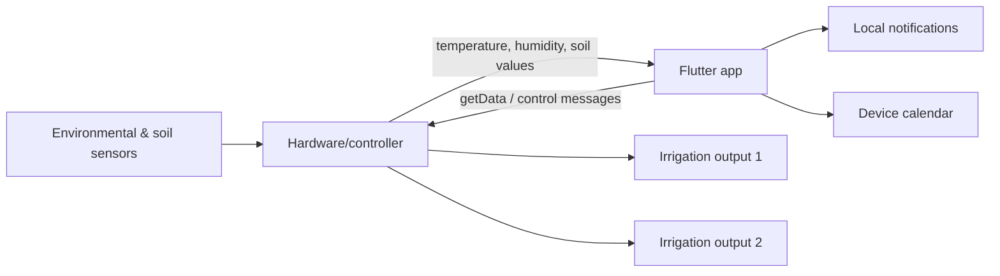

# System Overview

The repository contains two main software parts: a hardware-side controller and a Flutter mobile application.

## High-level architecture

The controller-side Python code requests sensor measurements through a TCP socket. It receives four comma-separated values: air temperature, air humidity, soil humidity for plant 1, and soil humidity for plant 2.

The control logic applies a threshold of `3000` to each soil-humidity value. When a value is above the threshold, the corresponding output is set to `1`; otherwise it is set to `0`.

The Flutter application also communicates over a socket. It periodically sends `getData`, parses the same measurements, presents them in the UI, and handles irrigation notifications.
